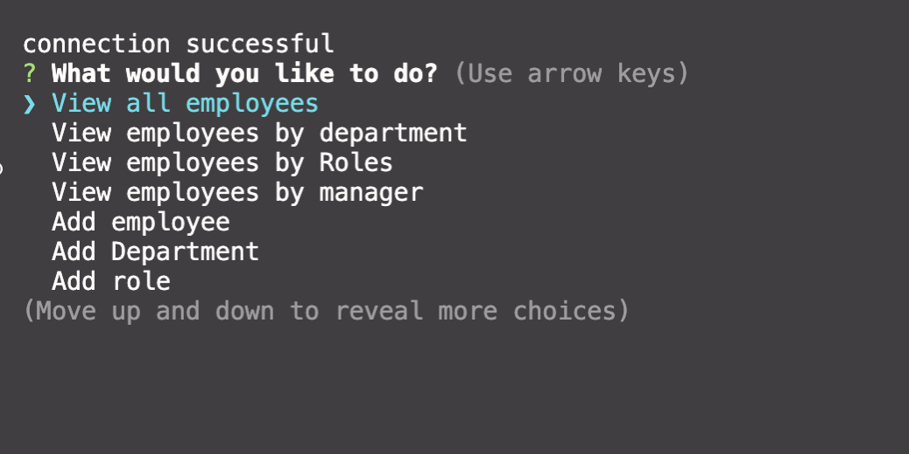
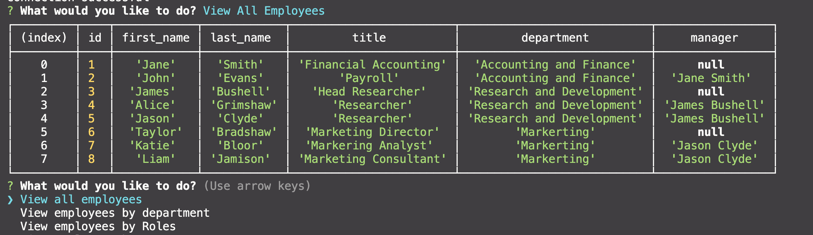
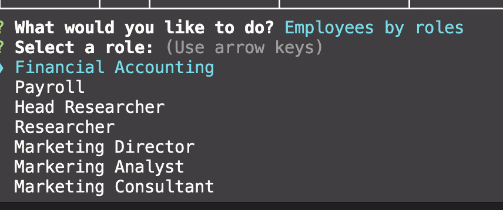
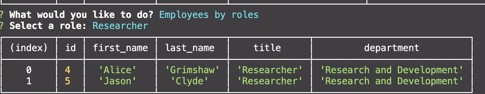
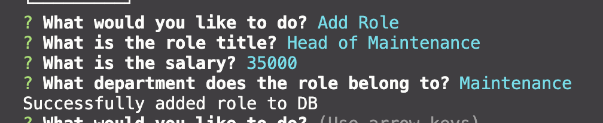

# Employee Tracker

## Description

An application designed and implemented to track current department, roles and employees within a company. Users can view all employees, view employees by role or department, as well as add, update or remove privileges.

## Table of Contents

- [Installation](#installation)
- [Usage](#usage)
- [Screenshots](#screenshots)
- [License](#license)
- [Contributing](#contributing)
- [Questions](#questions)

## Installation

To install all relevant dependencies run:

```npm install

```

## Usage

To use this project run:

```npm run start

```

## Screenshots & How to Use

- Using the menu options stated below, select which action you wish to take.Then follow the following instructions and questions in order to view or alter the employee tracker database.



- Start navigation menu allowing users to follow a number of actions available.



- Users can see a full list of employees within a company, displaying all relevant information about each employee.





- Users can see a list of employees through selecting a specific role.




- Users are able to add a new department to the system, and from there add roles and employees to it.

License
ISC License

Copyright (c) [2020], [Stephanie Morrissey]

Permission to use, copy, modify, and/or distribute this software for any purpose with or without fee is hereby granted, provided that the above copyright notice and this permission notice appear in all copies.

THE SOFTWARE IS PROVIDED "AS IS" AND THE AUTHOR DISCLAIMS ALL WARRANTIES WITH REGARD TO THIS SOFTWARE INCLUDING ALL IMPLIED WARRANTIES OF MERCHANTABILITY AND FITNESS. IN NO EVENT SHALL THE AUTHOR BE LIABLE FOR ANY SPECIAL, DIRECT, INDIRECT, OR CONSEQUENTIAL DAMAGES OR ANY DAMAGES WHATSOEVER RESULTING FROM LOSS OF USE, DATA OR PROFITS, WHETHER IN AN ACTION OF CONTRACT, NEGLIGENCE OR OTHER TORTIOUS ACTION, ARISING OUT OF OR IN CONNECTION WITH THE USE OR PERFORMANCE OF THIS SOFTWARE.

## Contributing
When contributing to this repository, please first discuss the change you wish to make via issue, email, or any other method with the owners of this repository before making a change.

## Contributing

When contributing to this repository, please first discuss the change you wish to make via issue, email, or any other method with the owners of this repository before making a change.

1. Fork
2. Clone and setup
   git clone <https://github.com/steph-morrissey/employee-tracker>
3. Develop
4. Pull request

## Credits

Stephanie Morrissey - <https://github.com/steph-morrissey>
